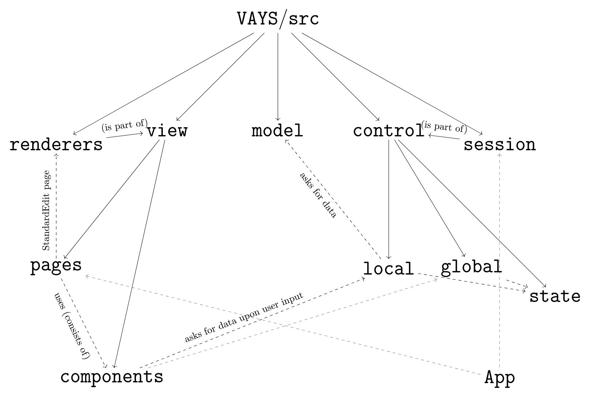

# Software Architecture

## Software Architecture

VAYS is structured for the most part along an architecture which is commonly used in frontend design: The MVC architecture.

This seperates the software into three main components.

1) The Model: This represents the data, which models 'the reality'. This is the part which interacts with YAC and hence, the CMDB. In fact, the model is structured here along the API. Each API call has, if warranted, a seperate module. There, all the different cases of return codes that this API call may return are handled. Caching is also handled in this part.

2) The Controller: This takes the data as it is sent from the API and is processed. The result is then handed over to the view. That is, the controller tells the view *what* to display. The controller is structured along the GUI: Every major component has its own control module. This module then calls the model for data. In the case that the webapp needs to send something, it is typically the controller which hands over this data in a format that the model understands - not necessarily the API. The model will then take care of making the correct API calls. The controllers are divided into local and global ones. Local ones are dealing with a component which is typically only used for a specific page. On the other hand, the global ones do not face such restriction.

The controller also has a state. The guideline is that this state is only ever directly accessed in the corresponding module of the controller.
If access is needed outside the module, then use getters and setters which are provided in the controller as well.

3) The View: The view is concerned with displaying the data it receives from the user. The controller tells *what* to display, the view is concerned with *how*. This is where the react code and the renderers live.

## Illustration

Solid lines indicate subfolder relation (except renderers, session, see label above arrow). Dotted lines indicate importing relation.

